You can deploy your apps via Github Repo, SSH, CI/CD Pipelines

### Create an empty app on Bunetic.com

### Step 1: Click on "Deploy New App"
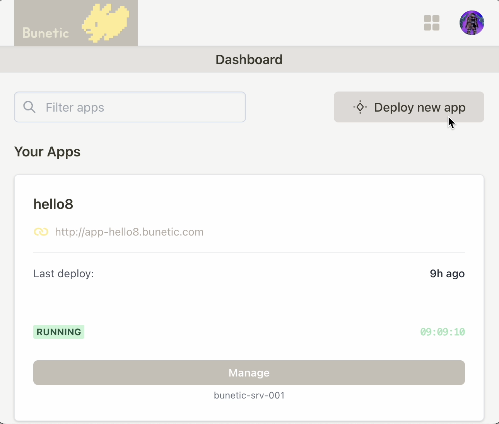

### 2: Choose a name for your app
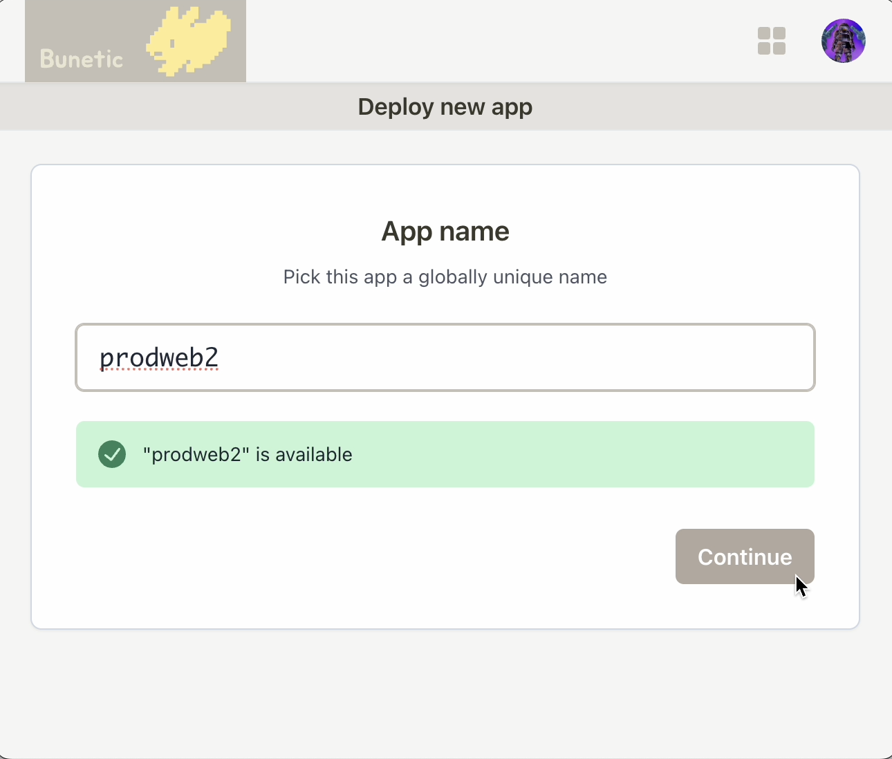

### 3: Choose a server
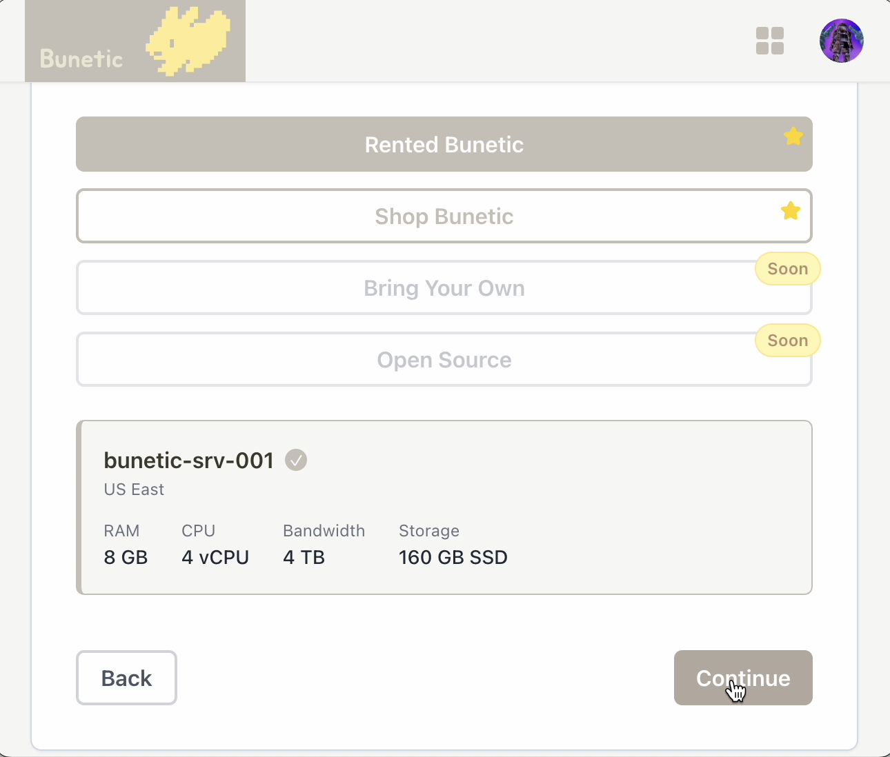

### 4: Add SSH Key
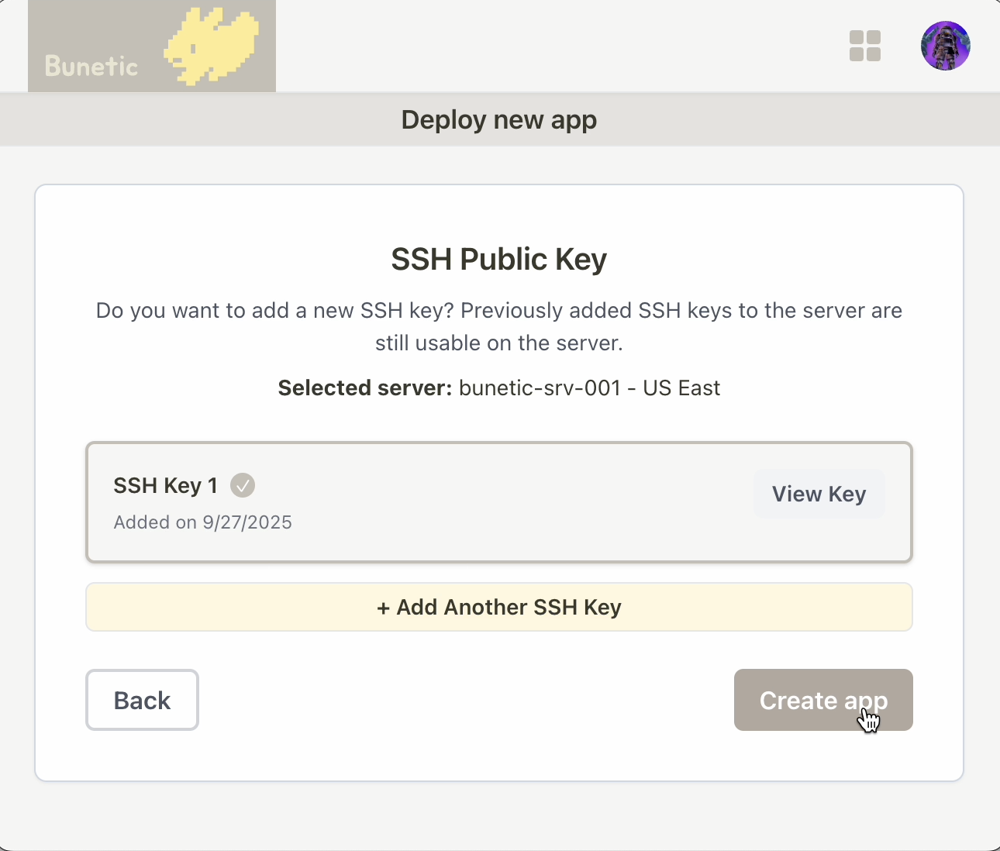

### 5: Wait a moment to finish set up
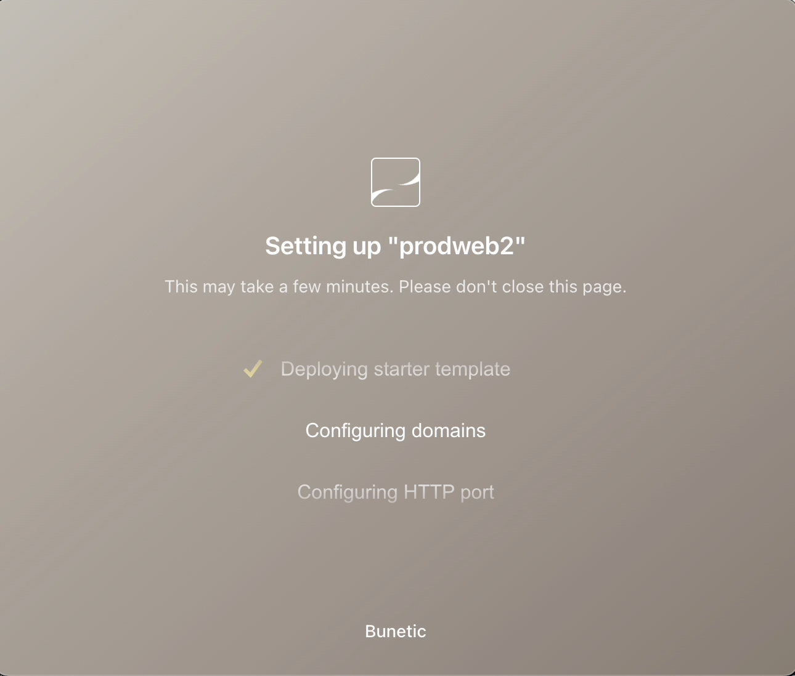

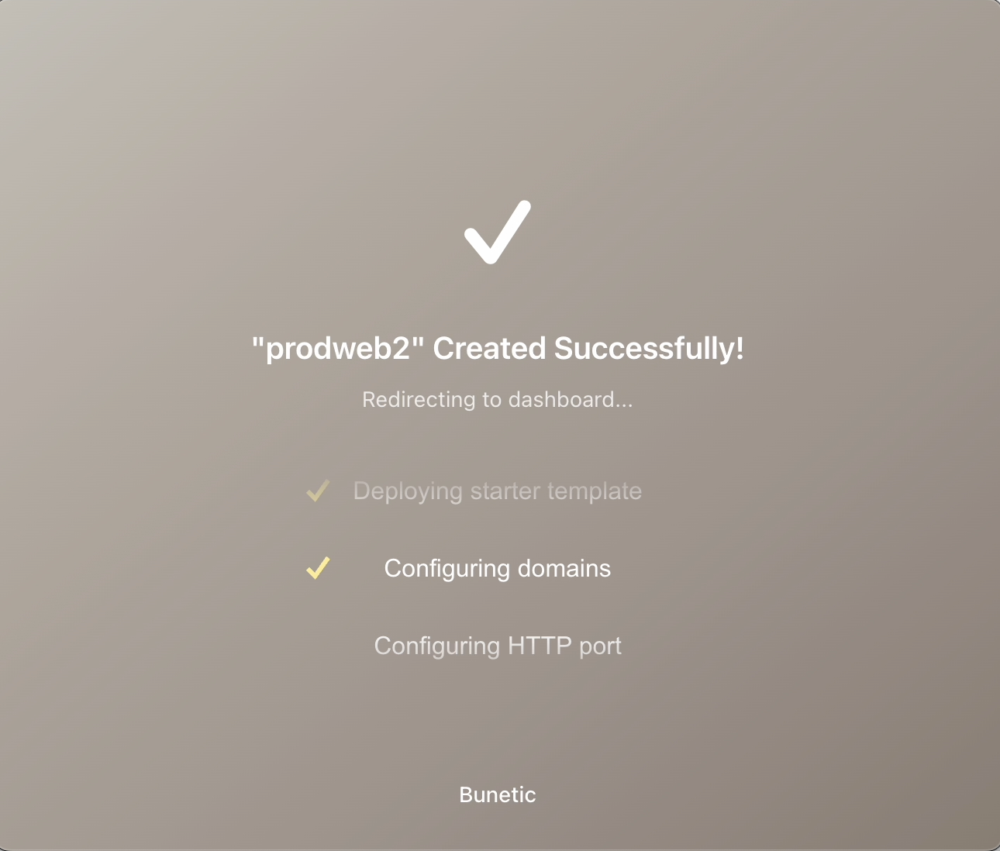

## Deploy via Github Repo

### 6: Choose Manage
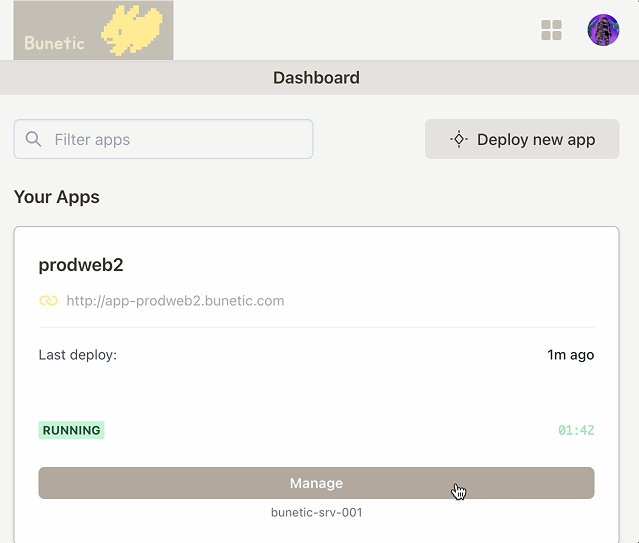

### 7: Choose Deploy
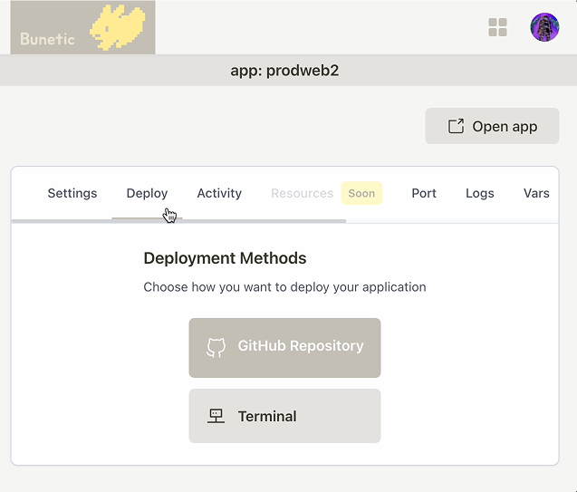

### 8: Connect Github
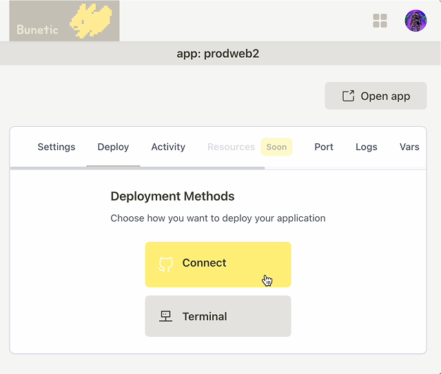

### 9: Connect Repo
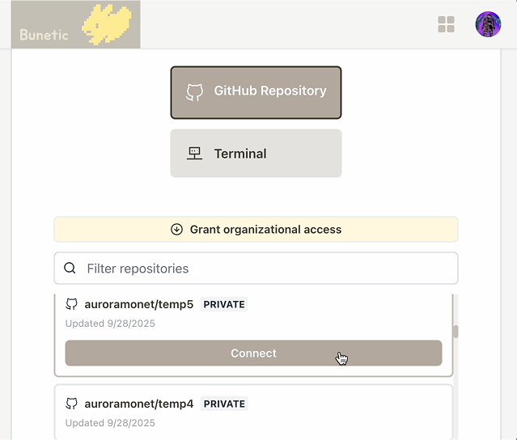

### 10: After connected, you can choose Manual Deploy or Auto Deploy
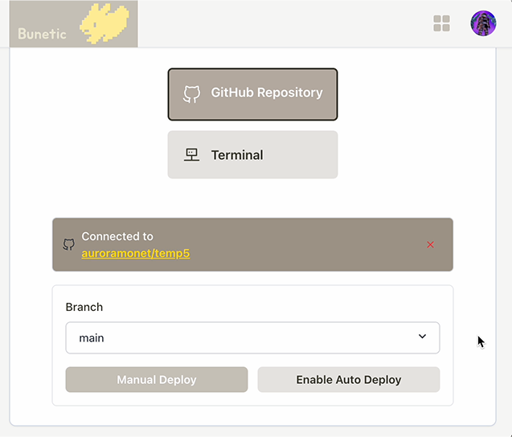

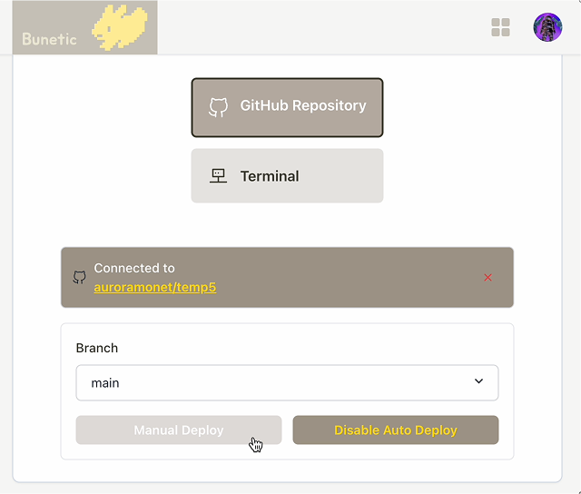

### 11: Done!
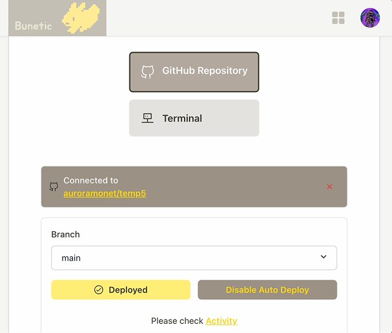
